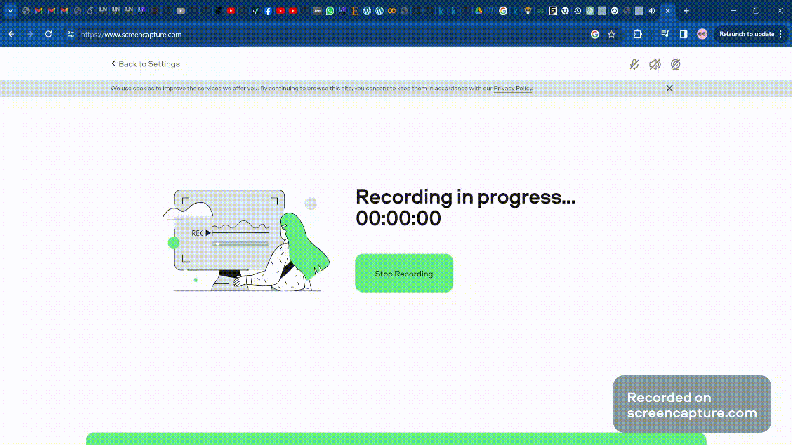

# Credit-Risk-Analysis
## Description

This project is a credit scoring model that predicts the Probability of Default (PD) for loan applicants. It aims to assist in evaluating the risk associated with potential borrowers.

## Features

- **Predictive Models:** Utilizes various machine learning algorithms to predict PD.
- **Interactive Form:** Provides a user-friendly form for inputting applicant data.
- **Real-time Scoring:** Generates Expected Loss (ECL) based on the PD and Exposure at Default (EAD).

## Technologies Used

- Python
- Flask
- HTML/CSS/JavaScript
- Scikit-learn
- Pandas
- etc.

## Demo

  

## Installation Instructions

To run this project locally, follow these steps:

1. Clone the repository.
2. Open the notebook in google colab.
3. Upload the directories and make sure you have the [data](https://www.kaggle.com/datasets/devanshi23/loan-data-2007-2014/data) as well.
4. Tap your ngrok auth token where required and run all cells.

## How to Use

1. Navigate to the web application.
2. Fill in the provided form with relevant applicant data.
3. Submit the form to get the calculated PD, EAD, and ECL.
4. Interpret the results.
